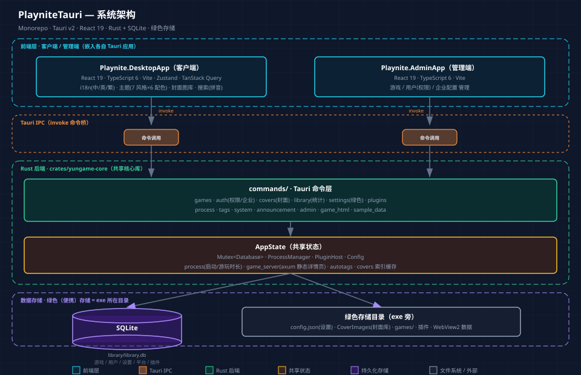

# 系统架构图

> 可视化 PlayniteTauri 整体架构：**Monorepo · Tauri v2 · React 19 · Rust + SQLite · 绿色存储**。
> 详细文字版架构见 [design/architecture.md](./design/architecture.md)。

## 架构图

**HTML 交互版**（推荐，浏览器直接打开，自包含、响应式、可打印）：
[点击打开 playnite-architecture.html](./diagram/playnite-architecture.html)

**SVG 矢量版**：


## 分层说明

### 1. 前端层（客户端 / 管理端）

| 应用 | 职责 | 技术 |
| --- | --- | --- |
| **Playnite.DesktopApp**（客户端） | 游戏库主界面 | React 19 · TS 6 · Vite · Zustand · TanStack Query |
| **Playnite.AdminApp**（管理端） | 游戏 / 用户 / 企业配置管理 | React 19 · TS 6 · Vite |

前端不直接访问数据库；所有数据读写经 Tauri 命令（`invoke`）走 Rust 后端。全局 UI 状态用
Zustand，服务端状态用 TanStack Query。国际化为 i18next（中/英/繁），主题为「7 风格 × 6 配色」
双轴即时切换。

### 2. Tauri IPC（命令桥）

React 组件调用 `src/api/client.ts` 封装的 `invoke`，触发后端 Rust 命令。命令返回
`Result`，前端处理 `ok` / `err`。

### 3. Rust 后端（crates/yungame-core）

共享核心库，提供 `run_client` / `run_admin` 两个 Builder 工厂：

- **commands/**：Tauri 命令层（games / auth / covers / library / settings / plugins /
  process / tags / system / announcement / admin / game_html / sample_data）
- **AppState**：共享状态（`Mutex<Database>`、`ProcessManager`、`PluginHost`、`Config`）
- **服务**：`process`（进程启动 / 游玩时长）、`game_server`（axum 静态详情页）、
  `autotags`（自动标签）、`covers`（封面索引缓存）

两个 Tauri 应用（desktop / admin）各自有独立的 `tauri.conf.json` / `frontendDist`，
只嵌入各自前端，彻底隔离。

### 4. 数据存储（绿色存储）

所有数据存 exe 所在目录，不写注册表、不使用 C 盘：

- **SQLite**（`library/library.db`）：游戏、用户、设置、平台、插件元数据
- **文件系统**：`config.json`（应用设置）、`CoverImages/`（封面库）、`games/`、插件、
  WebView2 用户数据

## 数据流

```
React UI (src/components)
    │  Tauri command (invoke)
    ▼
Rust command (crates/yungame-core/src/commands/*.rs)
    │
    ▼
AppState (Mutex<Database>, ProcessManager, PluginHost)
    │
    ▼
SQLite (library/library.db)  /  进程启动  /  文件系统
```

## 关键设计决策

1. **Monorepo 隔离**：每个 Tauri 应用独立嵌入前端，避免"管理端误加载客户端前端"、双窗口、
   cdylib 链接失败等问题。
2. **DB 用 `Mutex` 包裹**：`rusqlite::Connection` 是 `Send` 但非 `Sync`，需 `Mutex` 提供内部可变性。
3. **完全绿色存储**：`settings.rs` 用 `current_exe()` 定位数据根；debug 构建固定指向项目根 `release/`。
4. **窗口自动创建**：由 `tauri.conf.json` 保证嵌入前端资源正确加载。
5. **前端相对路径**（`base: "./"`）：保证资源在 `tauri://localhost` 下可解析。
